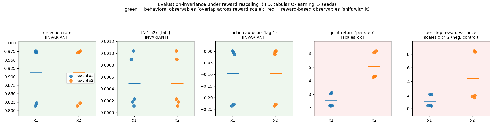

# Demo: evaluation-invariance under reward rescaling

A small, runnable smoke-test of the measurement machinery on the simplest,
*provable* corner of the invariance question: under reward rescaling, quantities
computed from a collective's **behavior** are invariant (the greedy policy is
unchanged), while quantities describing **reward outcomes** are not. If observables
of the first kind exist under *harder* setup changes too — algorithm, environment —
cross-paper and cross-setup comparison becomes possible, which is what multi-agent
evaluation currently lacks. That harder case is the program's real question; this demo
only shows the pipeline works where the answer is already known.

This is a smoke-test artifact, not a research result. It demonstrates the
measurement machinery on the simplest cooperative substrate in the canon, and
calibrates whether the [program](../docs/program-overview.md)'s first
empirical paper is realistically scoped.

## Setup

Two tabular Q-learning agents play the iterated prisoner's dilemma
(C/C = 3/3, D/D = 1/1, C/D = 0/5, D/C = 5/0; state = last two joint actions).
The **evaluation-setup transformation** is reward rescaling: multiply every
reward by a constant `c ∈ {1, 2}` during training.

It is a *controlled* experiment — per seed, the only thing that changes between
the two runs is `c`; the same random stream drives both. Because reward
rescaling multiplies the Bellman fixed point by `c` and leaves the greedy
policy unchanged, the learned behavior is identical, so behavioral observables
should be invariant while reward-denominated ones carry the factor.

## Result

Five seeds, 50k training steps, evaluated over 2000 steps:

| observable | ×1 | ×2 | ×2 / ×1 | |
|---|---|---|---|---|
| defection rate | 0.91 | 0.91 | **1.00** | invariant (behavioral) |
| `I(a₁;a₂)` [bits] | 0.0005 | 0.0005 | **1.00** | invariant (behavioral) |
| action autocorrelation (lag 1) | −0.095 | −0.095 | **1.00** | invariant (behavioral) |
| joint return (per step) | 2.52 | 5.05 | 2.00 | scales × c |
| per-step reward variance | 1.11 | 4.43 | 4.00 | scales × c² (negative control) |



The three behavioral observables are **bit-for-bit identical** across reward
scale, for every seed — not merely overlapping within seed variance. Joint
return scales linearly with `c`; the negative control (per-step reward
variance) scales as `c²`, confirming the invariance claim is discriminating
rather than vacuous.

## Run

```bash
uv sync
uv run python demo/test_observables.py   # known-answer tests for the estimators
uv run python demo/ipd_invariance.py     # writes results/ table, csv, figure
```

## Design notes

- **Native-scale reporting, not evaluate-all-at-one-scale.** Behavioral
  observables are functions of the action stream and are reward-scale-free by
  construction; reward observables are reported at each run's native scale `c`,
  which is what makes the contrast visible. Evaluating everything at a single
  scale would trivially flatten the reward observables too and erase the point.
- **Why invariance is exact here.** Reward rescaling is a strategic relabeling,
  the simplest member of the invariance group. Harder transformations the first
  paper targets — algorithm swap, observation-channel permutation — will show
  *statistical* invariance within seed variance, not the exact identity seen
  here. This demo establishes the measurement on the easiest case.
- **Regime note.** Independent Q-learners converge to mutual defection in
  the IPD (a known result), so coordination `I(a₁;a₂)` is genuinely low. That
  low value is itself reported invariantly across scale; the defection rate is
  the behavioral observable that is both clearly non-trivial *and* invariant.
  No hyperparameters were tuned to manufacture a prettier number — the
  invariance ratio is 1.00 in every regime regardless.
- **Action autocorrelation is computed from the action stream alone** — the
  external, no-privileged-access surface an outside evaluator can see, which is
  the headline use: rigorous behavioral measurement of a deployed collective from
  logs. (It is also a critical-slowing-down indicator from the tipping-point
  literature; whether such indicators give *early warning* in multi-agent AI is a
  hypothesis the program tests, not an assumption — see the overview's
  "AI safety relevance.")

## Relationship to the program

Concentric. The first paper's invariance claim is the larger circle —
cooperative deep MARL, two environments, two algorithms, five transformations.
This demo is a point inside it: tabular IPD, two agents, one transformation.
Showing the point is consistent with the framework demonstrates the framework
is operationally measurable. If the point had
failed, that would be information worth having before the larger empirical work.
