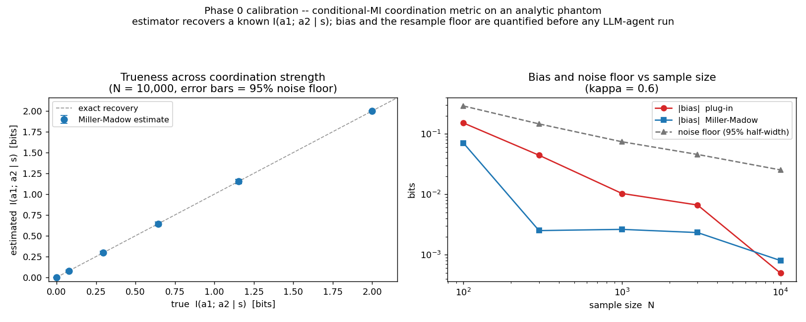
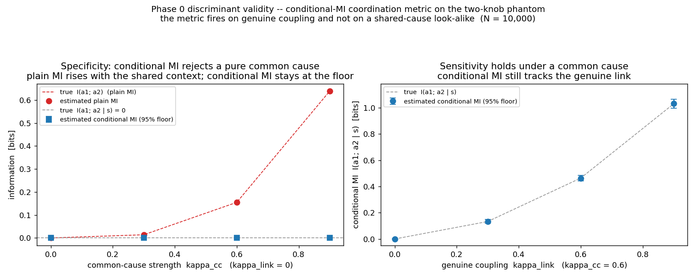
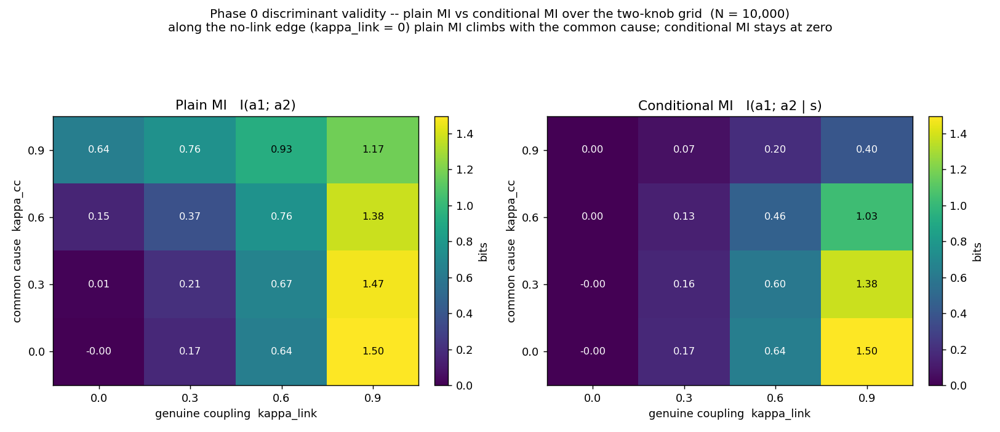
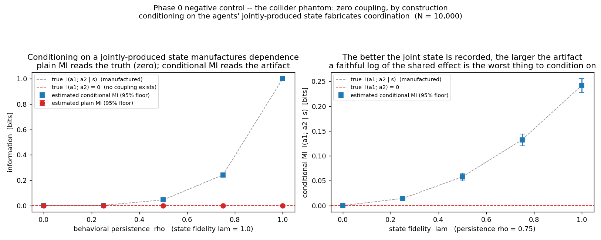
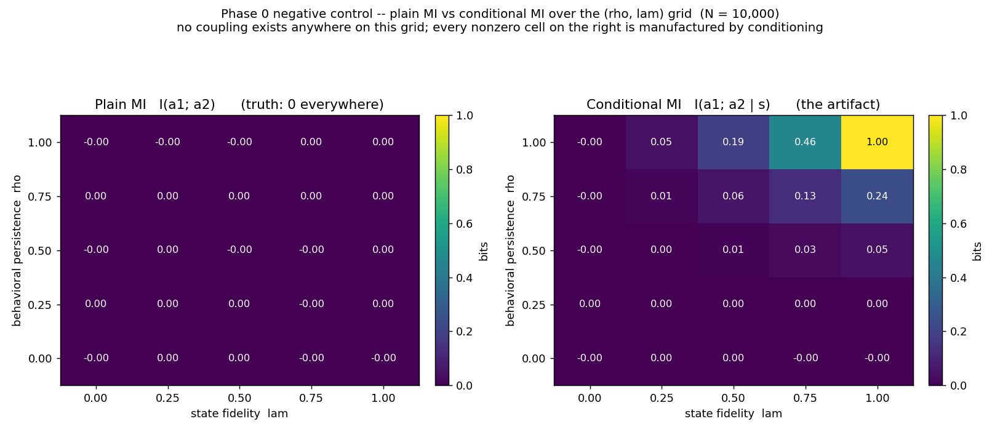
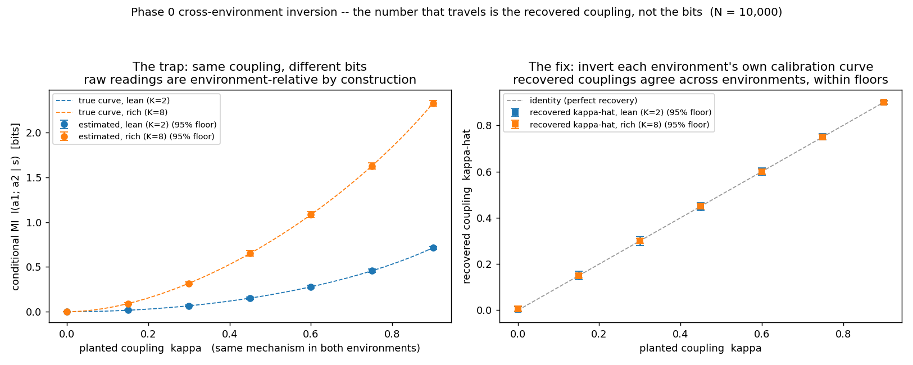
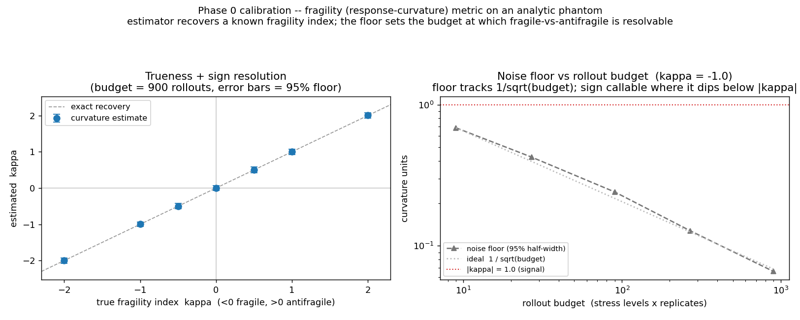
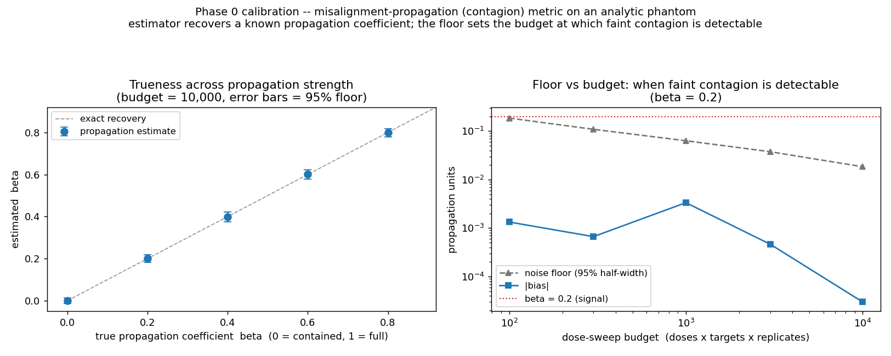
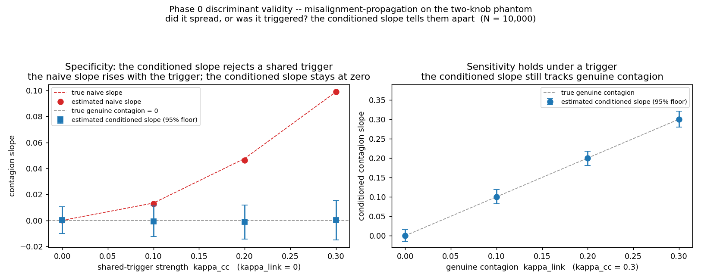
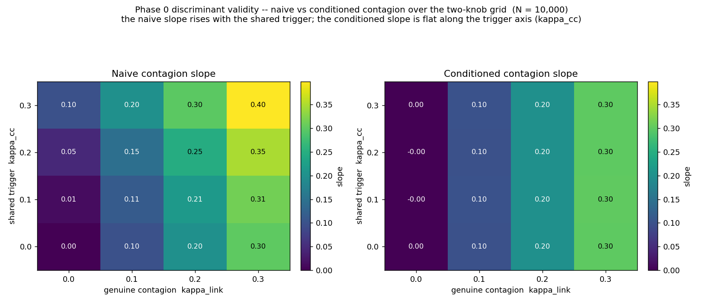

# Phase 0 — estimator calibration on known-answer phantoms

Before a collective-behavior metric is run on LLM-agent rollouts, its estimator
is calibrated against a synthetic source whose value is known in closed form. On
real data the estimator recovers a property it cannot check against ground truth;
here the ground truth is constructed, so estimator **bias** and the sampling
**noise floor** are measured directly. This is the de-risk gate the rest of the
program runs behind, at ~zero compute.

All three battery metrics are calibrated here; the coordination and propagation metrics additionally get discriminant-validity calibrations (do they reject a shared cause?), and a negative-control phantom calibrates the conditioning rule itself (conditioning on a shared *effect* manufactures dependence — the collider case below).

Why these three: one representative per family of the collective metrics the field is
publishing — a coordination/dependence measure (conditional mutual information), a
stress-response measure (curvature — the CAFE family), and a contagion measure
(dose-response slope). The gate is representative, not exhaustive; the paper-1 battery is
finalized by a reimplementability pass.

## What each calibration reports

- **trueness** — does the estimate track the known value across the metric's
  range, within a stated bound (sign included, where the sign is the question);
- **bias** — the finite-sample bias of the estimator vs sample size / budget;
- **noise floor** — the 95% interval half-width of the estimate over independent
  re-samples at a fixed configuration. A difference below the floor is not a
  result; with the floor printed, a later "this metric doesn't travel" cannot be
  confused with "we estimated it badly".

## Reading the figures

Each metric gets two panels.

- **Left — trueness.** The estimate vs the known value across the metric's range.
  Points on the dashed identity line, within their error bars (the 95% noise floor),
  mean the estimator is unbiased.
- **Right — precision.** The noise floor vs sample size / budget, log-log. A
  statistically efficient estimator's floor falls as **1/√N** (the dotted reference
  line); the floor at a given budget is the smallest effect that budget can resolve, so
  to detect an effect of size X you need the budget where the floor drops below X. Bias,
  where shown, sits far below the floor — it is reported in the left panel and the CSV.

## Coordination — conditional mutual information `I(a1; a2 | s)`

High when two agents coordinate within a context `s`, zero when independent. The
phantom (`coupled_source.py`) is a coupled categorical source with tunable
coupling `kappa`, so `I(a1; a2 | s)` is known exactly. The metric is conditional,
so the estimator stratifies by `s` and averages — and conditioning splits the
sample, which is where bias bites.

**Result:** at `N = 10,000` the Miller-Madow estimator recovers the known value to
**~0.001 bits** across the range; it roughly halves the plug-in's small-N
over-coordination bias (0.071 vs 0.152 bits at `N=100`); the **noise floor is
0.025 bits at `N=10,000`** (0.29 at `N=100`).



Run: `uv run python phase0/calibrate.py`.

## Coordination — discriminant validity (rejecting a common cause)

Recovering a known coupling (above) is *sensitivity*. The coordination metric is
*conditional* MI for a reason — it is meant to strip out a common cause, two agents
that look coupled only because a shared context drives both — and that, the metric's
reason for being, needs its own calibration. The phantom (`confound_source.py`) adds a
second knob: `kappa_cc` sets a shared per-context marginal that biases both agents (a
common cause, no direct link), independent of the genuine coupling `kappa_link`. At
`kappa_cc = 0` it reduces exactly to `coupled_source`.

**Result:** under a pure common cause (`kappa_link = 0`), plain MI climbs to **0.64 bits**
as `kappa_cc → 0.9` while conditional MI stays at **0.000 bits** within its ±0.001 floor —
the metric does not mistake a shared cause for coordination. With that common cause present
(`kappa_cc = 0.6`), conditional MI still tracks a genuine link near-unbiased (0.13 → 1.03
bits as `kappa_link → 0.9`). So the metric is **sensitivity + specificity**: it fires on
genuine coupling and not on a shared-cause look-alike.



And over the full grid -- plain MI rises with both the common cause and the genuine
link, while conditional MI stays at zero along the no-link edge (`kappa_link = 0`)
however strong the common cause (it does fall off at very high `kappa_cc` for a fixed
link, as the per-context marginal concentrates):



This is the calibration the **agent-specific confounds** turn on: two agents on the same
base model, or sharing a system prompt or context, behave alike without exchanging
influence. Those confounds are *observable* to an auditor, so they are conditionable —
exactly the case this phantom validates. A *latent* (unobserved) common cause remains the
honest limit of any behavior-only measure.

Run: `uv run python phase0/calibrate_confound.py`.

## Coordination — negative control (the collider: conditioning on a jointly-produced state)

The discriminant calibrations above validate conditioning where it is *right* — the context
is a common cause, and conditioning strips a false positive out. This phantom
(`collider_source.py`) calibrates the mirror case, where conditioning is the *mistake*: two
agents with independent private memories — zero coupling, by construction — jointly produce
a state `s` (a common *effect*; in causal-graph terms, a collider). Two knobs: behavioral
persistence `rho` (how faithfully each agent's actions reflect its private memory) and
state fidelity `lam` (how faithfully `s` records the joint product). Conditioning on `s`
manufactures dependence with the closed-form value `1 − H_b((1 − rho1·rho2·lam)/2)` —
governed by the single product, vanishing when any factor is zero, and reaching a full bit
at `rho = lam = 1`.

**Result:** plain MI reads the truth — **0.0000 within its ±0.0002 floor** across the whole
grid — while conditional MI reads the manufactured value near-unbiased (at `rho = 0.75,
lam = 1`: **0.2418 estimated vs 0.2421 true**, floor 0.0138; at `rho = lam = 1`: exactly
**1 bit** fabricated between agents that share nothing). The estimator is faithful in both
columns; the failure is the *conditioning choice*.



And over the `(rho, lam)` grid — no coupling exists anywhere on it; every nonzero cell in
the conditional panel is fabricated by the conditioning itself:



Together with the discriminant calibrations this pins the conditioning rule from both
sides: **condition on the shared cause; never on the shared effect.** For LLM-agent audits
the effect case is the generic trap, not an exotic one — the environment state at time t (a
shared scratchpad, a market price, a task artifact) is a product of both agents' earlier
actions, and an audit that stratifies on it fabricates exactly the coordination it is
looking for. Condition on exogenous inputs — task specification, configuration, episode
seeds — not on state the agents produced.

Run: `uv run python phase0/calibrate_collider.py`.

## Coordination — cross-environment inversion (the number that travels is κ̂, not the bits)

The invariance sweep's core move, exercised where the answer is known exactly. The *same*
copy-mechanism coupling `kappa` is planted in two structurally different environments —
lean (2 actions, 2 uniform contexts) and rich (8 actions, 3 skewed contexts) — and the raw
conditional-MI readings differ **by construction**: at `kappa = 0.6` the closed forms give
0.278 vs 1.083 bits — same coupling, 3.9× the bits (the ratio runs 5.6× → 3.3× across the
sweep). Raw information values are alphabet- and structure-relative, so comparing them
across environments compares the environments. That is the trap.

The fix (`inversion.py`): each environment's calibration curve `f_E(kappa)` is known here
in closed form (measured, on a real system); estimate the reading, invert the
environment's *own* curve, and compare the recovered couplings.

**Result:** at `N = 10,000`, the recovered couplings agree with the planted truth and with
each other at **every point of the sweep** — `|khat_lean − khat_rich| ≤ 0.002`, an order
of magnitude inside the combined floors — while the raw readings they came from differ by
up to a bit and a half. The `khat` floor widens near `kappa = 0`, where MI's quadratic
onset makes the curve flat: inversion is ill-conditioned exactly there — a property of the
problem, printed rather than hidden.



This is what "the measurement travels" means, operationally: not that raw bits agree —
they provably cannot — but that the *calibrated estimate of the generative coupling* does.
On real LLM-agent systems the closed-form curve is replaced by a measured dose-response
curve on engineered couplings; the inversion logic is identical.

Run: `uv run python phase0/calibrate_inversion.py`.

## Fragility / antifragility — response curvature

The fragility family (CAFE and kin) reduces to the curvature of a stress-response
`R(sigma)`: `< 0` is fragile (concave), `> 0` antifragile (convex). The phantom
(`fragility_source.py`) has a known curvature, observed as noisy replicate
rollouts; the estimator (`curvature_estimators.py`) fits the curve. Curvature is a
weak second-order feature, so the **floor sets the budget at which the sign is
callable**.

**Result:** near-unbiased (bias ~0.003 at 900 rollouts), sign recovered across the
range. The **floor falls from 0.69 (budget 9) to 0.066 (budget 900)**, so a
`|kappa| = 1` fragility resolves by ~budget 27, while `|kappa| = 0.5` needs
~budget 270+.



Run: `uv run python phase0/calibrate_fragility.py`.

## Misalignment-propagation — contagion coefficient

Plant a misalignment dose in a seed agent; the metric is the coefficient `beta` by
which it raises the rest of the collective's misalignment (`0` = contained, `1` =
full propagation). The motivating finding is Anthropic's *AI Organizations* result —
collectives can be less aligned than their members. That hazard was detected by ordinary
evals; what needs a calibrated instrument is the follow-up question detection alone cannot
answer — whether misalignment *spread* through the collective or tripped everywhere at
once — which is exactly the discriminant calibration below. The
phantom (`propagation_source.py`) has a known `beta`; the estimator
(`propagation_estimators.py`) is the dose-response slope. The **floor sets the
detection threshold** — when faint contagion is resolvable from none.

**Result:** near-unbiased (bias ~0.001), coefficient recovered across the range.
The **floor falls from 0.185 (budget 100) to 0.018 (budget 10,000)**, so a faint
contagion (`beta = 0.2`) is resolvable from zero by ~budget 300–1,000 — the
dose-sweep budget needed to claim a planted misalignment spread.



Run: `uv run python phase0/calibrate_propagation.py`.

## Misalignment-propagation — discriminant validity (spread vs. shared trigger)

The calibration above uses an *interventional* dose — you plant the misalignment in
the seed, so the contagion is causal by construction. An outside observer often
cannot intervene: they see one agent misaligned and others misaligned, and must ask
whether it *spread* (seed → target) or whether a *shared trigger* tripped both. The
phantom (`propagation_confound_source.py`) adds that knob: `kappa_cc` is a shared
trigger raising both the seed's and the targets' misalignment, independent of a
genuine seed → target link (`kappa_link`). Two readings — a **naive** contagion slope
(target rate among misaligned vs aligned seeds) and a **conditioned** slope (the same,
stratified by the trigger and averaged).

**Result:** under a pure shared trigger (`kappa_link = 0`), the naive slope climbs to
**0.10** as `kappa_cc → 0.3` — a trigger looks like spreading — while the conditioned
slope stays at **0.00** within its ±0.015 floor. With the trigger present
(`kappa_cc = 0.3`), the conditioned slope still recovers genuine contagion near-exactly
(0.10 → 0.30). So "did it spread?" is separable from "were both triggered?".



And over the full grid — the naive slope rises with both the shared trigger and the
genuine contagion, while the conditioned slope is flat along the trigger axis
(`kappa_cc`), reading exactly the genuine contagion whatever the trigger does:



Run: `uv run python phase0/calibrate_propagation_confound.py`.

## Scope

These calibrate metric *estimators* on known answers — they establish the floor
under which a later "this metric does / does not travel across LLM-agent setups"
result is interpretable rather than an artifact of estimation. They do not, on
their own, evidence cross-setup invariance. The discriminant phantoms model common
*causes* (a shared context, a shared trigger); the collider phantom covers the
complementary failure mode — conditioning on a common *effect* manufactures dependence —
so the conditioning rule is calibrated from both sides. The **next phase** runs these
calibrated estimators on small LLM-agent teams — the invariance sweep — with each
metric's floor, established here, printed under the result; the cross-environment
inversion above is that sweep's core move, exercised where the curves are known exactly.

## Run

```bash
uv run python phase0/calibrate.py             # coordination
uv run python phase0/calibrate_confound.py    # coordination: discriminant validity
uv run python phase0/calibrate_fragility.py   # fragility
uv run python phase0/calibrate_propagation.py # misalignment-propagation
uv run python phase0/calibrate_propagation_confound.py  # propagation: discriminant validity
uv run python phase0/calibrate_collider.py    # coordination: negative control (collider)
uv run python phase0/calibrate_inversion.py   # coordination: cross-environment inversion
# tests:
uv run python phase0/test_phase0.py
uv run python phase0/test_confound.py
uv run python phase0/test_collider.py
uv run python phase0/test_inversion.py
uv run python phase0/test_fragility.py
uv run python phase0/test_propagation.py
uv run python phase0/test_propagation_confound.py
```

## Files

Per metric: a `*_source.py` phantom (closed-form ground truth + sampler), an
estimators module, a `calibrate_*.py` sweep, and a `test_*.py` known-answer suite.

- coordination: `coupled_source.py` · `mi_estimators.py` · `calibrate.py` · `test_phase0.py`
- coordination, discriminant validity: `confound_source.py` · `calibrate_confound.py` · `test_confound.py`
- coordination, negative control (collider): `collider_source.py` · `calibrate_collider.py` · `test_collider.py`
- coordination, cross-environment inversion: `inversion.py` · `calibrate_inversion.py` · `test_inversion.py` (reuses `coupled_source.py`)
- fragility: `fragility_source.py` · `curvature_estimators.py` · `calibrate_fragility.py` · `test_fragility.py`
- propagation: `propagation_source.py` · `propagation_estimators.py` · `calibrate_propagation.py` · `test_propagation.py`
- propagation, discriminant validity: `propagation_confound_source.py` · `calibrate_propagation_confound.py` · `test_propagation_confound.py`
- `results/` — calibration figures and CSVs.
